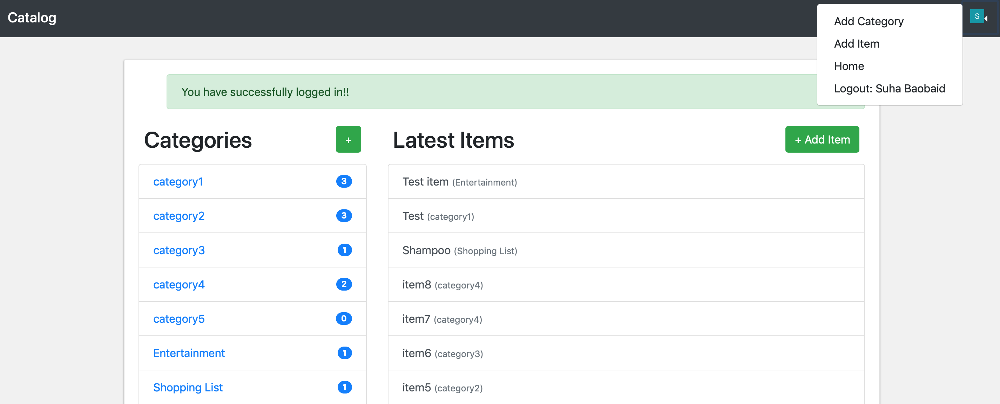

# Catalog project
> Suha Baobaid

## Project Overview
This is the fourth project for the course [ FullStack Nanodegree by Udacity](https://www.udacity.com/course/full-stack-web-developer-nanodegree--nd004 " FullStack Nanodegree by Udacity")
The project consists of developing an application that provides the list of items within a variety of categories, as well as user registeration and authentication system. The project utilizes a persistent store to create a RESTful web app to expose CRUD operations.

Only authenticated users can create items and categories and owners are allowed to edit and delete the created items and categories. Public catalog consisting of categories and item lists as well as item details is available.

Third-party auth with Google is used in this project. Technologies used to build the application include Flask, Bootstrap, and SQLite.

## Skills required
- Python
- Flask
- SqlAlchemy
- HTML
- CSS
- Bootstrap

# Running the project

## Required
- Python
- Vagrant
- VirtualBox

## Getting Started
- Install [Vagrant](https://www.vagrantup.com "Vagrant") and [VirtualBox](https://www.virtualbox.org "VirtualBox")
- Download or clone [fullStack repo](https://github.com/udacity/fullstack-nanodegree-vm "fullStack repo")
- Clone this repo into the 'catalog/' directory found in the vagrant folder.
- Open the terminal and head to the vagrant directry in fullstack-nanodegree-vm folder.
- Launch the virtual machine (See below for details of using VM) by running `vagrant up`, then login the VM by running `vagrant ssh`
- In the VM, change directory to `catalog` and run `sudo pip install -r requirements` to install dependecies
- Run the app using `python app.py`
- In your browser, go to `http://localhost:5000/catalog` to access the application

## JSON Endpoints
`/api/v1/catalog.json` - Returns the whole catalog including categories and their items


`/api/v1/categories.json` - Returns list of categories


`/api/v1/items.json` - Returns list of items


## REST Endpoints
#### --------------------------------------
#### CRUD for categories
#### --------------------------------------
`/` and `/catalog` - Public


`/` and `/catalog` - logged in


`/catalog/categories/new`

`/catalog/categories/<int:category_id>/edit`


`/catalog/categories/<int:category_id>/delete`


`/catalog/categories/<int:category_id>/items`


#### --------------------------------------
#### CRUD for category items
#### --------------------------------------
`/catalog/categories/<int:category_id>/items/<int:item_id>`


`/catalog/items/new`

`/catalog/items/<int:item_id>/edit`


`/catalog/items/<int:item_id>/delete`


#### --------------------------------------
#### Login
#### --------------------------------------
`/login`


`/logout`




#### Launching the virtual machine
1. Open the terminal and head to the vagrant directry fullstack-nanodegree-vm folder. Launch the Vagrant VM using command:
```
vagrant up
```
2. After the setup is done, log into the VM using this command:
```
vagrant ssh
```
3. Change the directory to vagrant(this is the shared folder, use ls command):
```bash
cd /vagrant
```
4. To log out of the VM use ctrl-C or the command (it may be needed to be done twice):
```
exit
```

# Issues

- No validation on forms

## Possible improvements

- Implementing CSRF protection on CRUD operations.
- Image upload to associate with items and/or categories
- Front-end improvements


